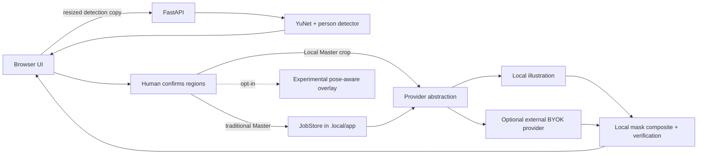

# Scene First

[简体中文](README.zh-CN.md)

**A local-first, privacy-aware photo editing toolkit for reducing unwanted identity exposure in scene photos.**

Scene First detects people, asks a human to confirm every target, then replaces or covers selected heads while preserving the surrounding scene. It runs without a paid AI provider, or can use your own provider key for optional AI-assisted edits.

> This project helps reduce unwanted identity exposure; it does not guarantee anonymity.

## What works today

Usable core:

- FastAPI backend with a static, mobile-friendly browser UI.
- Local YuNet face detection plus an OpenCV Zoo MediaPipe person-detector fallback.
- Human review: select, deselect, add, and adjust person/head regions before editing.
- Fully local `LocalIllustrationProvider`, deterministic geometric-cover fallback, local masks, local compositing, and exact outside-mask verification.
- Metadata-free PNG/JPEG working copies and exports.
- BYOK adapters for OpenAI, Gemini, fal.ai, Volcengine Ark, Black Forest Labs, and DashScope/Qwen.

Experimental:

- **Local Master:** the browser keeps the full-resolution original and uploads confirmed per-person crops for external AI; final compositing happens in the browser.
- **Pose-aware Avatar Overlay:** opt-in 2D routing infrastructure with a local photo playground. The public repository ships only a synthetic FRONT / 3/4 / BACK fixture; PROFILE preview requires a separately licensed user-imported avatar pack. It is not a calibrated production privacy gate.
- **Cloudflare Containers:** deployment configuration exists, but self-hosters must provide their own account, secrets, domain, retention policy, and security review.

## Privacy modes

The privacy boundary depends on both where FastAPI runs and which provider is selected.

| Mode | Full original leaves device? | Selected crop sent to provider? | API cost owner |
| --- | --- | --- | --- |
| Local app + local provider | No; browser-to-`localhost` traffic remains on the same computer | No | None |
| Local app + external BYOK provider, crop scope | No | Yes | User/key owner |
| Local app + Local Master + external provider | No; a resized detection copy reaches local FastAPI | Yes | User/key owner |
| Remote self-hosted traditional Master | Yes, to the operator's FastAPI server | Yes when an external provider is selected | Operator/key owner |
| Remote self-hosted Local Master | No full-resolution original; a detection copy and confirmed crops leave the device | Yes | Operator/key owner |

The public UI requests crop-scoped provider calls. The backend API also contains a `cloud_scope=full` compatibility path; using it with an external provider sends the full working image to that provider. Review [PRIVACY.md](PRIVACY.md) before exposing this application to other people.

## Architecture



See [Architecture](docs/ARCHITECTURE.md) and [Development](docs/DEVELOPMENT.md) for the full lifecycle.

## Windows Quick Start

Requirements: Windows 10/11, Python 3.12, Node.js 22+, and PowerShell.

```powershell
git clone https://github.com/YOUR-ACCOUNT/YOUR-REPOSITORY.git
cd YOUR-REPOSITORY
npm install
npm run app:setup
npm run app:start
```

Open <http://127.0.0.1:8765>. No `.env.local` and no paid provider are required. Add a photo, review the detected regions, then choose the local illustration or safe-cover path. Runtime files are written under `.local/app/` and are ignored by Git.

The setup script discovers Python 3.12 through the Windows `py` launcher or `python`, with an optional `SCENE_FIRST_PYTHON` override for non-standard installations. Windows is the currently verified development platform. Linux and macOS are **not yet officially tested**; the PowerShell setup scripts are Windows-specific.

## BYOK provider setup

1. Copy `.env.example` to `.env.local`.
2. Add only the key for the provider you intend to use, such as `OPENAI_API_KEY`, `GEMINI_API_KEY`, `FAL_KEY`, `ARK_API_KEY`, `BFL_API_KEY`, or `DASHSCOPE_API_KEY`.
3. Restart the app and confirm the provider appears as configured.

Keys are read by FastAPI and are not intentionally returned to the browser. The local Settings page can write `.env.local`; do not expose that page on an untrusted network. Provider calls can transmit selected image content to that provider, whose terms, retention, safety processing, and fees apply. See [Providers](docs/PROVIDERS.md) and [Configuration](docs/CONFIGURATION.md).

## Tests

```powershell
npm run app:test
npm run cf:typecheck
npm run app:validate-avatar -- assets/avatar_families/generic
npm run app:check-placeholders
```

Browser and staging scripts are local/manual because they depend on installed Chrome, a running server, or deployment credentials. CI never calls a paid provider and never reads `.local`.

## Docker and Cloudflare

`Dockerfile` packages FastAPI, static assets, and the two reviewed OpenCV model weights. Build locally with:

```powershell
docker build -t scene-first .
docker run --rm -p 8765:8765 scene-first
```

`wrangler.jsonc` and `wrangler.staging.jsonc` describe a Cloudflare Worker + Container topology without the author's account or domain. Deployment is optional and is not a turnkey privacy guarantee: configure secrets, access control, storage lifetime, logs, and a domain in your own account. No deployment occurs during normal local setup.

## Status and limitations

Scene First is an **active experimental project**, not a hosted service or a security-certified anonymization product. Detection can miss small, occluded, profile, or back-facing people; users must inspect the entire image and add missed regions. Illustration may still preserve identifying context such as clothing, body shape, companions, location, text, reflections, or metadata outside the exported image. External providers receive image data as described above.

Pose-aware overlay, Local Master, provider-specific results, mobile HEIC behavior, and Cloudflare deployment need broader independent testing. Do not use the tool as the sole control for high-risk identity protection.

## Roadmap

The short public roadmap is in [ROADMAP.md](ROADMAP.md): safer onboarding, clearer retention controls, stronger synthetic tests, provider conformance, and careful maturation of the pose-aware overlay.

## Contributing and security

- Read [CONTRIBUTING.md](CONTRIBUTING.md) before opening a pull request.
- Report vulnerabilities through the private process in [SECURITY.md](SECURITY.md); never attach a private photo or key to a public issue.
- Community participation follows [CODE_OF_CONDUCT.md](CODE_OF_CONDUCT.md).
- Release history is in [CHANGELOG.md](CHANGELOG.md).

## License

Project source code and documentation are licensed under [Apache-2.0](LICENSE). The public geometric covers, icon, and generic avatar fixture are deterministic project-source assets under the same license. Bundled model weights retain their upstream terms; see [ASSETS_LICENSE.md](ASSETS_LICENSE.md) and [THIRD_PARTY_NOTICES.md](THIRD_PARTY_NOTICES.md).

Avatar packs are pluggable assets and may use licenses independent of the core source code. Before redistributing a pack, review its own license and the rights to every included image.
