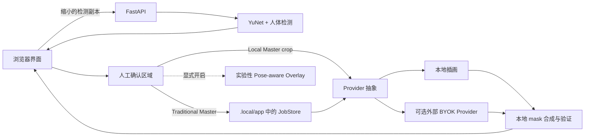

# Scene First

[English](README.md)

**一个本地优先、关注隐私边界的照片编辑工具，用来降低场景照片中不希望出现的身份暴露。**

Scene First 先检测人物，再要求用户逐个确认处理对象，最后替换或覆盖选中的头部，同时尽量保持周围场景不变。它不配置付费 AI 也能运行；如果需要 AI 编辑，使用者可自行配置 Provider Key 并承担费用。

> 本项目帮助降低不必要的身份暴露，但不保证匿名。

## 当前能力

可用核心：

- FastAPI 后端与适配手机的静态网页界面；
- 本地 YuNet 人脸检测，加 OpenCV Zoo MediaPipe 人体检测补充；
- 人工确认：选择、取消、补框、调整人物/头部区域；
- 完全本地的 `LocalIllustrationProvider`、确定性几何遮罩回退、本地 mask、本地合成和 mask 外像素一致性验证；
- 去除图像元数据的 PNG/JPEG 工作副本与导出；
- OpenAI、Gemini、fal.ai、火山方舟、Black Forest Labs、DashScope/Qwen 的 BYOK 适配器。

实验能力：

- **Local Master**：浏览器保留全分辨率原图，只把人工确认的人物 crop 交给外部 AI，最终在浏览器合成；
- **Pose-aware Avatar Overlay**：显式开启后的二维路由基础设施和本地照片 Playground；公开仓库只附带 synthetic FRONT / 3/4 / BACK fixture，PROFILE 预览需要用户另行导入许可清晰的 avatar pack；它尚不是完成校准的生产隐私 Gate；
- **Cloudflare Containers**：已有部署拓扑，但自托管者必须使用自己的账户、密钥、域名，并自行决定访问控制、留存和安全策略。

## 隐私模式

真实边界同时取决于 FastAPI 跑在哪里，以及选择了哪个 Provider。

| 模式 | 完整原图离开设备？ | 选中 crop 发给 Provider？ | API 费用承担者 |
| --- | --- | --- | --- |
| 本机应用 + 本地 Provider | 否；浏览器到 `localhost` 仍在同一台电脑 | 否 | 无 |
| 本机应用 + 外部 BYOK Provider（crop scope） | 否 | 是 | 用户 / Key 所有人 |
| 本机应用 + Local Master + 外部 Provider | 否；缩小的检测副本会到本机 FastAPI | 是 | 用户 / Key 所有人 |
| 远程自托管 Traditional Master | 是，原图会到运营者的 FastAPI 服务 | 选择外部 Provider 时会 | 运营者 / Key 所有人 |
| 远程自托管 Local Master | 全分辨率原图不会；检测副本和确认 crop 会离开设备 | 是 | 运营者 / Key 所有人 |

公开 UI 默认要求 crop 范围的 Provider 调用。后端 API 仍保留 `cloud_scope=full` 兼容路径；如果它与外部 Provider 一起使用，完整工作图会发给该 Provider。对外开放服务前请阅读 [PRIVACY.md](PRIVACY.md)。

## 当前架构



完整生命周期见 [架构文档](docs/ARCHITECTURE.md) 与 [开发文档](docs/DEVELOPMENT.md)。

## Windows 快速开始

需要 Windows 10/11、Python 3.12、Node.js 22+ 和 PowerShell。

```powershell
git clone https://github.com/YOUR-ACCOUNT/YOUR-REPOSITORY.git
cd YOUR-REPOSITORY
npm install
npm run app:setup
npm run app:start
```

打开 <http://127.0.0.1:8765>。无需 `.env.local` 或付费 Provider：添加照片、检查并确认人物区域，然后使用本地插画或安全封面路径。运行数据写入 `.local/app/`，Git 默认忽略该目录。

设置脚本会通过 Windows 的 `py` 启动器或 `python` 查找 Python 3.12；非标准安装可显式设置 `SCENE_FIRST_PYTHON`。当前正式验证平台是 Windows；Linux 和 macOS **尚未正式测试**，现有 PowerShell 脚本只面向 Windows。

## 配置自己的 Provider Key

1. 把 `.env.example` 复制为 `.env.local`；
2. 只填实际要使用的 Key，例如 `OPENAI_API_KEY`、`GEMINI_API_KEY`、`FAL_KEY`、`ARK_API_KEY`、`BFL_API_KEY` 或 `DASHSCOPE_API_KEY`；
3. 重启应用，确认 Provider 显示为已配置。

Key 由 FastAPI 读取，代码不会主动把它返回浏览器。本地 Settings 页面能写入 `.env.local`，不要在不可信网络中公开该页面。外部 Provider 会收到本文表格说明的图像内容，其服务条款、留存、安全处理和计费规则均适用。详见 [Provider 文档](docs/PROVIDERS.md) 与 [配置文档](docs/CONFIGURATION.md)。

## 测试

```powershell
npm run app:test
npm run cf:typecheck
npm run app:validate-avatar -- assets/avatar_families/generic
npm run app:check-placeholders
```

浏览器与 staging 脚本依赖已安装 Chrome、正在运行的服务或部署凭据，因此保留为本地/人工测试。CI 不调用付费 Provider，也不读取 `.local`。

## Docker 与 Cloudflare

`Dockerfile` 会打包 FastAPI、静态资源和两份已经核验许可的 OpenCV 模型权重：

```powershell
docker build -t scene-first .
docker run --rm -p 8765:8765 scene-first
```

`wrangler.jsonc` 与 `wrangler.staging.jsonc` 描述 Worker + Container 拓扑，但不再包含作者账户和域名。部署是可选项，也不是自动获得隐私保证：请在自己的账户中配置 Secret、访问控制、留存、日志和域名。普通本地安装不会触发部署。

## 状态与限制

Scene First 是一个**活跃的实验项目**，不是托管服务，也不是经过安全认证的匿名化产品。自动检测可能漏掉远处、遮挡、侧脸或背面人物，用户必须检查整张照片并补框。插画处理后，服装、体型、同行者、地点、文字、反射或其他上下文仍可能暴露身份。外部 Provider 会按上文边界收到图像数据。

Pose-aware Overlay、Local Master、不同 Provider 的实际效果、移动端 HEIC 和 Cloudflare 部署仍需更广泛的独立验证。高风险身份保护不能只依赖本工具。

## 参与项目

- 公开路线见 [ROADMAP.md](ROADMAP.md)；
- 提交 PR 前阅读 [CONTRIBUTING.md](CONTRIBUTING.md)；
- 安全问题按 [SECURITY.md](SECURITY.md) 私下报告，公共 Issue 中绝不能附私人照片或 Key；
- 社区行为遵循 [CODE_OF_CONDUCT.md](CODE_OF_CONDUCT.md)；
- 版本变化见 [CHANGELOG.md](CHANGELOG.md)。

## 许可证

项目源代码与文档采用 [Apache-2.0](LICENSE)。公开版本中的几何遮罩、图标和 generic avatar fixture 是确定性生成的项目源码资产，使用相同许可；模型权重保留其上游条款，见 [ASSETS_LICENSE.md](ASSETS_LICENSE.md) 与 [THIRD_PARTY_NOTICES.md](THIRD_PARTY_NOTICES.md)。

Avatar pack 是可插拔资产，其许可可以独立于核心源码。再分发任何 pack 前，必须检查该 pack 的许可证以及其中每张图片的权利来源。
