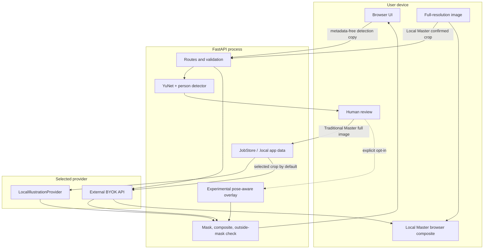

# Architecture

Scene First separates detection, human intent, generation, and compositing so that an external image provider does not decide which people to edit or which scene pixels to retain.

## Boundaries

### Browser

The browser owns file selection, optional pre-crop, visual review, manual box editing, and export. In Local Master it also owns the full-resolution source and final compositing. Browser memory is not durable storage, but browser extensions, the operating system, and screenshots remain outside this project's control.

### FastAPI

FastAPI validates byte counts, pixel counts, identifiers, crop geometry, feature flags, and provider configuration. It serves the UI, runs local detection, and coordinates jobs. When local, it is a loopback process. When deployed remotely, it is a data processor operated by the deployer.

### Detection and human confirmation

Detection proposes regions. It never proves that every person was found. Editing requests carry selected regions and a confirmation marker; low-confidence detections are not silently discarded after explicit confirmation. Manual regions remain first-class inputs.

### JobStore and persistence

`JobStore`, Master state, per-person jobs, images, previews, and cost ledgers persist beneath `.local/app/`. Files use random identifiers, not encryption. The app has no account/tenant model and no built-in retention scheduler, so `.local` must be protected and cleaned by the operator.

### Provider abstraction

Providers receive a crop and mask interface. Not every API accepts a mask, so the non-negotiable boundary is the crop plus final local mask composite. The normal UI uses crop scope. The legacy/full API option is documented because it materially changes privacy.

### Compositing and verification

The server constructs a head/neck mask, composites the provider patch into an immutable source, and verifies exact equality outside the mask's finite support. Local Master mirrors the final composition in the browser. Verification shows that a particular output did not change mask-external pixels; it does not prove anonymity or provider deletion.

### Pose-aware overlay

The experimental overlay routes an estimated pose to a 2D avatar scene, computes transform/coverage information, and emits detailed decision traces. The clean public repository includes only the deterministic `generic` geometry fixture; it demonstrates registry/import behavior but is not a designed product pack and does not cover PROFILE scenes. Users can import independently licensed packs. The production router remains conservative and feature-flagged.

### Cloudflare Container

The Worker forwards requests to a Durable Object-backed Container and injects public-mode/runtime variables. Optional password and admin-restart controls exist in the Worker. The checked-in config has no maintainer account/domain and is a starting topology, not a hardened hosted service. Container-local `.local` persistence and lifecycle differ from a workstation and require an operator decision.
